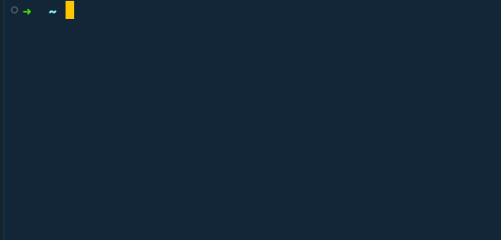
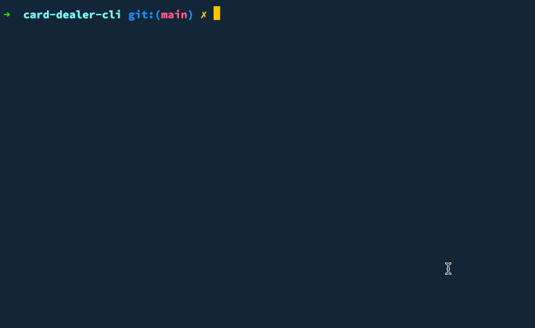

# Card Dealer CLI

CLI utility for interacting with a deck of cards. You can draw a random card or cards from various types of decks (standard, euchre, pinochle, or canasta). You can also deal a hand for several card games: blackjack, poker, euchre, pinochle, canasta, or gin.

## Installation

```sh
npm install -g card-dealer-cli
```

## CLI Usage

There are two commands available: `pick-a-card` and `deal-a-hand`

```sh
Usage: card-dealer [options] [command]

Options:
  -p, --perfect-shuffle        Should all randomness be removed when shuffling the deck? (default:
                               false)
  -t, --shuffle-times <times>  How many times should we shuffle the deck? (default: 7)
  --cut [Y/n]                  Do you want to cut the deck after shuffling?
  -h, --help                   display help for command

Commands:
  pick-a-card [options]        Pick a random card or cards from a deck
  deal-a-hand [options]        Deal a hand for one of several types of card games
  help [command]               display help for command
```

### `pick-a-card`

Pick a random card (or multiple cards) from a deck of cards.



(_This is the default command, so it will run if you don't specify another command_)

```sh
Usage: card-dealer pick-a-card [options]

Pick a random card or cards from a deck

Options:
  -d, --deck <deck-type>  What type of deck should we use (choices: "standard", "euchre", "canasta", "pinochle", default: "standard")
  -c, --count <number>    How many cards should be chosen? (default: 1)
  --top                   Should the card be pulled from the top of the deck, rather than at a random point in the deck? (default: false)
  -h, --help              display help for command
```

#### Examples

Pick a random card from a standard 52 card deck:

```sh
card-dealer
```

Cut the deck after shuffling without being prompted

```sh
card-dealer pick-a-card --cut
```

Do not shuffle or cut the deck and pick a card off the top of the deck. (This will not be random at all).

```sh
card-dealer pick-a-card --shuffle-times 0 --cut n --top
```

Pick two random cards from a canata deck:

```sh
card-dealer pick-a-card --deck canasta --count 2
```

### `deal-a-hand`

Deal the initial hand for several types of cards games: blackjack, poker, euchre, pinochle, canasta, or gin.



```sh
Usage: card-dealer deal-a-hand [options]

Deal a hand for one of several types of card games

Options:
  -g, --game <game-type>  What card game should we deal a hand for? (choices: "blackjack", "poker", "euchre", "pinochle", "canasta", "gin")
  -h, --help              display help for command
```

#### Examples

Deal hand, being prompted for what game

```sh
card-dealer deal-a-hand
```

Deal a game of Texas hold 'em poker

```sh
card-dealer deal-a-hand --game poker
```

Deal a game Euchre without shuffling, only cutting the deck once

```sh
card-dealer deal-a-hand --game euchre --shuffle-times 0 --cut
```

## Importing libs

In addition to the CLI utility, you can also import the underlying classes and objects for use in your own application.

```sh
npm install card-dealer-cli
```

### Usage

```ts
import { StandardDeck, CanastaDeck } from 'card-dealer-cli'

const deck = new StandardDeck()
const canastaDeck = new CanastaDeck()

console.log(deck.count) # => 52
console.log(canastaDeck.count) # => 108

# Shuffle the deck three times
deck.riffleShuffle(3)
# Cut the deck
deck.cut()

const hands = deck.dealHands({ cardsPerHand: 5, numberOfHands: 3 })

console.log(hands[0].showCards()) # => ♠️ J   ♣️ 2   ♣️ 5   ♥ 3   ♦ 2
```

See the [`BaseDeck` definition](./src/lib/base-deck.ts) for available functions on `deck` objects and in [`deck.ts`](./src/lib/deck.ts) for the types of decks available. Look in the [`lib` directory](./src/lib/) for defintions of other objects such as `Card` and `Hand`
